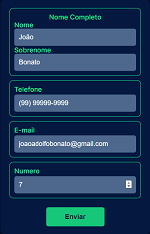

<strong><h1 align="center">Desafio</h1></strong>
Bora de desafio?

# Link para o projeto:
https://boradedesafio.onrender.com

<h2> Como deve funcionar: </h2>

1) Página HTML com Validação CSS

Campos: 

- Nome Completo: Aceita apenas Letras (até 100 caracteres)
- Telefone: Máscara para Telefone Celular e Fixo
- E-mail: Verifica se é um e-mail válido
- Número: Aceitar número de 1 a 999

Botão Enviar

2) Receber os dados e fornecer a resposta para:

2.1)
- Se (Número é divisível por 3) então imprimir o Primeiro Nome	 
- Se (Número é divisível por 5) então imprimir o DDD do Telefone
- Se (Número é divisível por 7) então imprimir o domínio do e-mail
- Se nenhuma situação anterior, imprimir as respostas para as lógicas dos itens 2.2 e 2.3.
	 
2.2) Quantidade de letras do Nome Completo, excluindo os espaços.
2.3) Quantidade de caracteres excluindo @ e pontos do e-mail.

3) Na resposta possuir um botão para voltar para o formulário.

# Exemplo:

  

  

## 🚀 Tecnologias

Esse projeto foi desenvolvido com as seguintes tecnologias:

- HTML
- CSS
- Python
- Flask
- Git

---

<strong>
By [João A. Bonato](https://bonatoneto.github.io/devlinks/)
</strong>